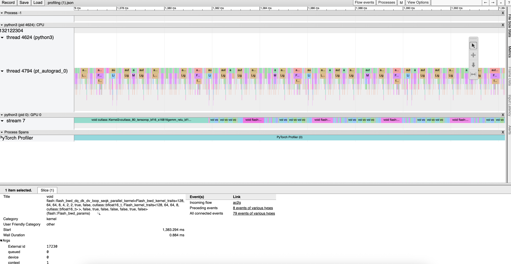

# causal-self-attention-benchmark-B200

Benchmark causal self-attention (BFloat16, forward+backward) across attention backends and GPU hardware.

## Motivation

MFU was reported low (< 50%) on B200 from [Scicom-AI-Enterprise-Organization/small-malaysian-lm-B200](https://github.com/Scicom-AI-Enterprise-Organization/small-malaysian-lm-B200) during full-parameter Qwen3 1.7B finetuning at 4K with proper multipacking. Profiling showed significant time spent in attention backward:



Before running full experiments, we benchmark attention backends across different sequence lengths and document packing scenarios.

## Benchmark scenarios

1. **Single document** (full length): `[1024, 2048, 4096, 8192, 12288, 16384, 32768, 65536]`
2. **Consistent multi-doc splits**: same total length split into equal chunks, splits `[4, 5, 6, 7, 8, 9]`
3. **Randomized varlen**: random chunk sizes summing to total length, splits `[4, 5, 6, 7, 8, 9]`

## How to run

Generate reproducible random sequences (or use pre-generated ones in [randomize/](randomize/)):

```bash
python3 generate_random.py
```

Run benchmarks (v1, up to 12K tokens):

```bash
python3 run.py --attention "fa3"       > outputs/out-fa3
python3 run.py --attention "fa2"       > outputs/out-fa2
python3 run.py --attention "flex"      > outputs/out-flex
python3 run.py --attention "fa_triton" > outputs/out-fa-triton
```

Run benchmarks (v2, up to 65K tokens, includes FA4):

```bash
python3 run.py --attention "fa4"       > outputs-v2/out-fa4
python3 run.py --attention "fa3"       > outputs-v2/out-fa3
python3 run.py --attention "fa2"       > outputs-v2/out-fa2
python3 run.py --attention "flex"      > outputs-v2/out-flex
python3 run.py --attention "fa_triton" > outputs-v2/out-fa-triton
```

## Results

All times are `fwd+bwd` latency in milliseconds, single batch.

### v1 — up to 12K tokens (`outputs/`)

#### Single document

| total_len | FA3 H100 | FA2 H100 | Flex H100 | FA2 B200 | Flex B200 | FA-Triton B200 | FA2 5090 | Flex 5090 |
|----------:|:--------:|:--------:|:---------:|:--------:|:---------:|:--------------:|:--------:|:---------:|
| 1024      | 0.309    | 0.523    | 2.308     | 0.346    | 1.378     | 0.412          | 0.377    | 1.520     |
| 2048      | 0.462    | 0.790    | 3.086     | 0.672    | 1.916     | 1.097          | 0.895    | 2.676     |
| 4096      | 1.145    | 2.081    | 5.570     | 1.843    | 4.166     | 2.538          | 2.760    | 6.495     |
| 8192      | 3.412    | 6.526    | 15.105    | 6.031    | 7.362     | 8.198          | 9.640    | 21.576    |
| 12288     | 7.240    | 13.469   | 30.319    | 12.754   | 14.560    | 17.275         | 20.819   | 46.471    |

**Hardware:** H100 = NVIDIA H100 80GB HBM3 (SXM), 5090 = NVIDIA GeForce RTX 5090

Full multi-doc results: [outputs/](outputs/)

---

### v2 — up to 65K tokens (`outputs-v2/`)

Adds Flash Attention 4 (FA4) and extends sequence lengths to 65536. All times in milliseconds (fwd+bwd, single batch).

**Key findings:**
- **FA4 on B200 is the clear winner at long context** — 2.1× faster than FA4 on H100 at 65K tokens, and ~3.4× faster than FA2 on B200
- **FA3/FA4 on H100 are comparable** at all sequence lengths
- **Flex Attention is significantly slower** across all hardware — roughly 4–8× slower than FA3/FA4 at large sequences
- **FA-Triton on B200** falls between FA2 B200 and Flex B200 at long context
- **Multi-doc packing dramatically reduces attention cost** — splitting 65K into 8 equal chunks cuts FA4 B200 time from 95.6 ms to 15.0 ms (~6.4×)

#### Single document

| total_len | FA4 B200 | FA4 H100 | FA3 H100 | FA2 H100 | FA2 B200 | FA-Triton B200 | Flex B200 | Flex H100 |
|----------:|:--------:|:--------:|:--------:|:--------:|:--------:|:--------------:|:---------:|:---------:|
| 1024      | 1.850    | 0.386    | 0.361    | 0.399    | 0.352    | 2.462          | 8.544     | 1.871     |
| 2048      | 2.894    | 0.507    | 0.510    | 0.740    | 0.669    | 3.144          | 9.729     | 2.686     |
| 4096      | 2.917    | 1.166    | 1.100    | 2.017    | 1.838    | 4.137          | 10.260    | 5.198     |
| 8192      | 3.293    | 3.502    | 3.399    | 6.464    | 6.035    | 8.777          | 12.592    | 14.673    |
| 12288     | 4.385    | 7.767    | 7.478    | 13.763   | 12.685   | 17.822         | 17.847    | 30.039    |
| 16384     | 6.725    | 13.164   | 12.739   | 23.421   | 21.808   | 30.393         | 26.347    | 51.673    |
| 32768     | 24.783   | 52.578   | 49.992   | 92.290   | 82.974   | 118.652        | 91.169    | 199.195   |
| 65536     | **95.604** | 202.336 | 195.760 | 369.234  | 325.841  | 485.893        | 353.303   | 791.442   |

---

#### Consistent multi-doc, splits=4 (max_len = total_len / 4)

| total_len | FA4 B200 | FA4 H100 | FA3 H100 | FA2 H100 | FA2 B200 | FA-Triton B200 | Flex B200 | Flex H100 |
|----------:|:--------:|:--------:|:--------:|:--------:|:--------:|:--------------:|:---------:|:---------:|
| 1024      | 1.543    | 0.309    | 0.349    | 0.329    | 0.274    | 2.918          | 5.621     | 1.972     |
| 2048      | 2.922    | 0.394    | 0.429    | 0.442    | 0.368    | 2.965          | 8.899     | 2.160     |
| 4096      | 2.901    | 0.648    | 0.648    | 0.853    | 0.713    | 3.099          | 8.930     | 2.797     |
| 8192      | 2.766    | 1.471    | 1.426    | 2.219    | 1.935    | 4.265          | 9.510     | 5.459     |
| 12288     | 2.767    | 2.628    | 2.530    | 4.313    | 3.774    | 6.199          | 10.993    | 9.615     |
| 16384     | 3.460    | 4.212    | 3.972    | 7.023    | 6.235    | 9.303          | 12.785    | 15.330    |
| 32768     | 7.640    | 14.740   | 13.881   | 24.463   | 22.294   | 31.339         | 28.243    | 54.573    |
| 65536     | 26.649   | 54.958   | 52.737   | 94.737   | 84.385   | 117.991        | 99.306    | 208.524   |

#### Consistent multi-doc, splits=6 (max_len = total_len / 6)

| total_len | FA4 B200 | FA4 H100 | FA3 H100 | FA2 H100 | FA2 B200 | FA-Triton B200 | Flex B200 | Flex H100 |
|----------:|:--------:|:--------:|:--------:|:--------:|:--------:|:--------------:|:---------:|:---------:|
| 12288     | 2.570    | 2.183    | 2.112    | 3.201    | 2.773    | 4.939          | 6.735     | 7.253     |

#### Consistent multi-doc, splits=8 (max_len = total_len / 8)

| total_len | FA4 B200 | FA4 H100 | FA3 H100 | FA2 H100 | FA2 B200 | FA-Triton B200 | Flex B200 | Flex H100 |
|----------:|:--------:|:--------:|:--------:|:--------:|:--------:|:--------------:|:---------:|:---------:|
| 1024      | 0.802    | 0.307    | 0.349    | 0.356    | 0.250    | 2.973          | 8.518     | 1.927     |
| 2048      | 1.031    | 0.380    | 0.418    | 0.428    | 0.317    | 3.115          | 8.924     | 2.072     |
| 4096      | 1.524    | 0.578    | 0.612    | 0.680    | 0.527    | 3.091          | 8.916     | 2.424     |
| 8192      | 2.098    | 1.134    | 1.108    | 1.508    | 1.245    | 3.476          | 9.099     | 3.875     |
| 12288     | 1.620    | 1.835    | 1.807    | 2.709    | 2.274    | 4.626          | 9.822     | 6.103     |
| 16384     | 2.228    | 2.701    | 2.629    | 4.214    | 3.610    | 6.056          | 10.937    | 9.292     |
| 32768     | 4.890    | 8.370    | 7.984    | 13.545   | 12.075   | 17.576         | 18.662    | 30.385    |
| 65536     | 14.998   | 29.500   | 27.775   | 49.744   | 43.957   | 61.664         | 57.041    | 112.101   |

---

#### Randomized varlen, splits=4

| total_len | FA4 B200 | FA4 H100 | FA3 H100 | FA2 H100 | FA2 B200 | FA-Triton B200 | Flex B200 | Flex H100 |
|----------:|:--------:|:--------:|:--------:|:--------:|:--------:|:--------------:|:---------:|:---------:|
| 1024      | 2.786    | 0.308    | 0.353    | 0.361    | 0.286    | 1.804          | 5.369     | 2.029     |
| 2048      | 2.758    | 0.398    | 0.438    | 0.484    | 0.381    | 3.133          | 8.801     | 2.306     |
| 4096      | 2.922    | 0.666    | 0.664    | 0.922    | 0.743    | 3.106          | 5.768     | 3.022     |
| 8192      | 2.718    | 1.521    | 1.470    | 2.367    | 2.013    | 4.339          | 9.035     | 5.940     |
| 12288     | 2.248    | 2.665    | 2.537    | 4.348    | 3.817    | 6.253          | 11.290    | 10.215    |
| 16384     | 3.352    | 4.281    | 4.317    | 7.131    | 6.350    | 9.477          | 13.279    | 16.154    |
| 32768     | 7.845    | 14.936   | 14.345   | 24.970   | 22.638   | 31.703         | 29.341    | 56.126    |
| 65536     | 26.839   | 54.482   | 51.967   | 95.406   | 84.915   | 118.993        | 101.412   | 211.792   |

#### Randomized varlen, splits=5

| total_len | FA4 B200 | FA4 H100 | FA3 H100 | FA2 H100 | FA2 B200 | FA-Triton B200 | Flex B200 | Flex H100 |
|----------:|:--------:|:--------:|:--------:|:--------:|:--------:|:--------------:|:---------:|:---------:|
| 1024      | 1.851    | 0.311    | 0.422    | 0.362    | 0.263    | 1.525          | 5.522     | 2.016     |
| 2048      | 2.811    | 0.397    | 0.482    | 0.466    | 0.360    | 3.022          | 8.486     | 2.219     |
| 4096      | 2.865    | 0.646    | 0.691    | 0.801    | 0.657    | 3.096          | 8.861     | 2.901     |
| 8192      | 2.720    | 1.342    | 1.329    | 1.976    | 1.700    | 3.829          | 9.534     | 5.335     |
| 12288     | 2.750    | 2.346    | 2.264    | 3.688    | 3.252    | 5.615          | 10.660    | 8.884     |
| 16384     | 3.093    | 3.687    | 3.537    | 5.956    | 5.317    | 7.932          | 12.594    | 13.779    |
| 32768     | 6.542    | 12.412   | 12.235   | 20.228   | 18.353   | 25.960         | 25.377    | 46.592    |
| 65536     | 21.939   | 44.066   | 42.327   | 76.905   | 68.628   | 97.060         | 84.619    | 173.422   |

#### Randomized varlen, splits=6

| total_len | FA4 B200 | FA4 H100 | FA3 H100 | FA2 H100 | FA2 B200 | FA-Triton B200 | Flex B200 | Flex H100 |
|----------:|:--------:|:--------:|:--------:|:--------:|:--------:|:--------------:|:---------:|:---------:|
| 1024      | 2.459    | 0.307    | 0.427    | 0.354    | 0.253    | 2.347          | 5.515     | 2.004     |
| 2048      | 2.765    | 0.411    | 0.482    | 0.460    | 0.346    | 2.981          | 5.412     | 2.203     |
| 4096      | 2.861    | 0.627    | 0.683    | 0.765    | 0.616    | 3.126          | 7.143     | 2.787     |
| 8192      | 2.131    | 1.265    | 1.245    | 1.790    | 1.511    | 3.815          | 9.415     | 4.850     |
| 12288     | 1.684    | 2.120    | 2.087    | 3.368    | 2.862    | 5.283          | 10.410    | 7.891     |
| 16384     | 3.101    | 3.245    | 3.141    | 5.295    | 4.608    | 7.077          | 11.964    | 12.134    |
| 32768     | 5.860    | 11.271   | 10.179   | 17.410   | 15.602   | 22.296         | 22.536    | 40.199    |
| 65536     | 19.049   | 37.358   | 36.062   | 65.700   | 57.922   | 80.866         | 73.414    | 147.519   |

#### Randomized varlen, splits=7

| total_len | FA4 B200 | FA4 H100 | FA3 H100 | FA2 H100 | FA2 B200 | FA-Triton B200 | Flex B200 | Flex H100 |
|----------:|:--------:|:--------:|:--------:|:--------:|:--------:|:--------------:|:---------:|:---------:|
| 1024      | 2.917    | 0.311    | 0.429    | 0.360    | 0.259    | 1.931          | 5.496     | 1.971     |
| 2048      | 2.667    | 0.385    | 0.480    | 0.452    | 0.342    | 3.073          | 8.969     | 2.164     |
| 4096      | 2.919    | 0.606    | 0.689    | 0.744    | 0.592    | 3.107          | 8.914     | 2.714     |
| 8192      | 2.844    | 1.207    | 1.215    | 1.690    | 1.412    | 3.623          | 9.289     | 4.461     |
| 12288     | 1.888    | 1.971    | 1.939    | 2.987    | 2.566    | 4.937          | 10.159    | 7.409     |
| 16384     | 3.180    | 2.965    | 2.908    | 4.693    | 4.106    | 6.560          | 11.946    | 11.076    |
| 32768     | 5.373    | 9.439    | 9.103    | 15.368   | 13.750   | 19.923         | 20.906    | 35.680    |
| 65536     | 16.958   | 32.833   | 31.574   | 57.147   | 50.325   | 70.689         | 65.409    | 129.345   |

#### Randomized varlen, splits=8

| total_len | FA4 B200 | FA4 H100 | FA3 H100 | FA2 H100 | FA2 B200 | FA-Triton B200 | Flex B200 | Flex H100 |
|----------:|:--------:|:--------:|:--------:|:--------:|:--------:|:--------------:|:---------:|:---------:|
| 1024      | 2.228    | 0.310    | 0.348    | 0.330    | 0.260    | 3.050          | 8.722     | 2.001     |
| 2048      | 2.254    | 0.413    | 0.478    | 0.418    | 0.339    | 3.053          | 8.985     | 2.142     |
| 4096      | 2.510    | 0.605    | 0.630    | 0.718    | 0.565    | 3.103          | 8.920     | 2.690     |
| 8192      | 1.620    | 1.169    | 1.161    | 1.599    | 1.300    | 3.499          | 9.258     | 4.319     |
| 12288     | 2.089    | 1.920    | 1.909    | 2.822    | 2.377    | 4.704          | 9.912     | 6.719     |
| 16384     | 2.393    | 2.775    | 2.744    | 4.337    | 3.717    | 6.147          | 11.487    | 10.234    |
| 32768     | 5.097    | 8.507    | 8.120    | 13.820   | 12.277   | 17.864         | 19.684    | 32.249    |
| 65536     | 15.228   | 30.287   | 29.197   | 49.892   | 44.405   | 62.382         | 59.429    | 115.465   |

#### Randomized varlen, splits=9

| total_len | FA4 B200 | FA4 H100 | FA3 H100 | FA2 H100 | FA2 B200 | FA-Triton B200 | Flex B200 | Flex H100 |
|----------:|:--------:|:--------:|:--------:|:--------:|:--------:|:--------------:|:---------:|:---------:|
| 1024      | 2.347    | 0.305    | 0.355    | 0.321    | 0.267    | 2.715          | 8.751     | 1.965     |
| 2048      | 1.336    | 0.382    | 0.427    | 0.587    | 0.475    | 2.953          | 8.949     | 2.149     |
| 4096      | 1.235    | 0.591    | 0.628    | 0.690    | 0.549    | 3.108          | 8.907     | 2.601     |
| 8192      | 1.243    | 1.137    | 1.105    | 1.478    | 1.220    | 3.411          | 9.268     | 4.223     |
| 12288     | 1.714    | 1.805    | 1.781    | 2.587    | 2.189    | 4.468          | 9.959     | 6.477     |
| 16384     | 2.162    | 2.645    | 2.588    | 4.052    | 3.456    | 5.866          | 11.334    | 9.718     |
| 32768     | 4.693    | 7.695    | 7.462    | 12.634   | 11.157   | 16.210         | 18.579    | 29.593    |
| 65536     | 13.910   | 26.310   | 25.137   | 44.543   | 39.899   | 56.064         | 54.772    | 104.827   |
